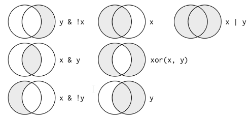

```{r setup, include=FALSE}
knitr::opts_chunk$set(echo = TRUE)
```

```{r}
library(nycflights13)
library(tidyverse)
```

The data set "flights" will be used for the following examples. To learn more about the data set, please use `?flights`.
The data set is ni **tibble** format. The common variable types include - 

* `int` stands for integers.
* `dbl` stands for doubles, or real numbers.
* `chr` stands for character vectors, or strings.
* `dttm` stands for date-times (a date + a time).
* `lgl` stands for logical, vectors that contain only TRUE or FALSE.
* `fctr` stands for factors, which R uses to represent categorical variables with fixed possible values.
* `date` stands for dates.


```{r}
head(flights)
```

**major dplyr functions**

* Pick observations by their values `filter()`.
* Reorder the rows `arrange()`.
* Pick variables by their names `select()`.
* Create new variables with functions of existing variables `mutate()`.
* Collapse many values down to a single summary `summarise()`.
* change the scope `group_by()`


### filter()
print out the result and also assign the result to a new variable dec25.

```{r}
(dec25 <- filter(flights, month == 12, day == 25))
```

**Notes** `==` brings problem when dealing with floating point numbers. Please use `near(` instead
```{r}
1/49 * 49 == 1

near(1/49 * 49, 1)
```



* use `|` and `&`, don't use `||` and `&&`.
* use `%in%` instead of `|` to simplify 
* `!(x & y)` is the same as `!x | !y`
* `!(x | y)` is the same as `!x & !y`

```{r}
nov_dec <- filter(flights, month %in% c(11, 12))

# filter(flights, month == 11 | month == 12)
```

**missing values** is contagious. 
```{r}
NA > 5
#> [1] NA
10 == NA
#> [1] NA
NA + 10
#> [1] NA
NA / 2
#> [1] NA
NA == NA
#> [1] NA
```

to check if the value is NA, `is.na()`


`filter()` only includes rows where the condition is TRUE; it excludes both FALSE and NA values. If you want to preserve missing values, ask for them explicitly:
```{r}
df <- tibble(x = c(1, NA, 3))
filter(df, x > 1)

filter(df, is.na(x) | x > 1)
```

### arrange()

When sorting columns, NA are sorted at the end. 
```{r}
arrange(flights, year, month, day)

arrange(flights, desc(dep_delay))
```

### select()
```{r}
select(flights, year, month, day)

# select(flights, year:day)

select(flights, -(year:day))

```


In addition, you can use **selection helpers**. Some helpers select specific columns:

* `starts_with()`: Starts with a prefix.

* `ends_with()`: Ends with a suffix.

* `contains()`: Contains a literal string.

* `matches()`: Matches a regular expression.

* `num_range()`: Matches a numerical range like x01, x02, x03.

```{r}
select(flights, matches('time'))

```


**rename* columns
```{r}
rename(flights, tail_num = tailnum)
```


**everything()**
move columns to the beginning 
```{r}
select(flights, time_hour, air_time, everything())
```

### mutate()
```{r}
flights_sml <- select(flights, 
  year:day, 
  ends_with("delay"), 
  distance, 
  air_time
)
mutate(flights_sml,
  gain = dep_delay - arr_delay,
  speed = distance / air_time * 60
)

# to keep the new variables only
transmute(flights,
  gain = dep_delay - arr_delay,
  hours = air_time / 60,
  gain_per_hour = gain / hours
)
```

available operators include 

* `+`, `-`, `^`

* `sum()`, `mean()`

* `%/%` (integer division), `%%` (remainder)

* `log()`, `log2()`, `log10()`


```{r}
transmute(flights,
  dep_time,
  hour = dep_time %/% 100,
  minute = dep_time %% 100
)
```


* `lead()`, `lag()`

```{r}
(x <- 1:10)
#>  [1]  1  2  3  4  5  6  7  8  9 10
lag(x)
#>  [1] NA  1  2  3  4  5  6  7  8  9
lead(x)
#>  [1]  2  3  4  5  6  7  8  9 10 NA
```


* `cumsum()`, `cumprod()`, `cummin()`, `cummax()`; and dplyr provides `cummean()` for cumulative means.

```{r}
x
#>  [1]  1  2  3  4  5  6  7  8  9 10
cumsum(x)
#>  [1]  1  3  6 10 15 21 28 36 45 55
cummean(x)

```

* `min_rank()`, `row_number()`, `dense_rank()`, `percent_rank()`, `cume_dist()`, `ntile()`
```{r}
y <- c(1, 2, 2, NA, 3, 4)
min_rank(y)
#> [1]  1  2  2 NA  4  5
min_rank(desc(y))
#> [1]  5  3  3 NA  2  1
row_number(y)
#> [1]  1  2  3 NA  4  5
dense_rank(y)
#> [1]  1  2  2 NA  3  4
percent_rank(y)
#> [1] 0.00 0.25 0.25   NA 0.75 1.00
cume_dist(y)
#> [1] 0.2 0.6 0.6  NA 0.8 1.0
```

### summarise()
```{r}
summarise(flights, delay = mean(dep_delay, na.rm = TRUE))

by_day <- group_by(flights, year, month, day)
summarise(by_day, delay = mean(dep_delay, na.rm = TRUE))
```

**pipe** `%>%`
```{r}
delays <- flights %>% 
  group_by(dest) %>% 
  summarise(
    count = n(),
    dist = mean(distance, na.rm = TRUE),
    delay = mean(arr_delay, na.rm = TRUE)
  ) %>% 
  filter(count > 20, dest != "HNL")


ggplot(data = delays, mapping = aes(x = dist, y = delay)) +
  geom_point(aes(size = count), alpha = 1/3) +
  geom_smooth(se = FALSE)
```


```{r}
flights %>% 
  group_by(year, month, day) %>% 
  summarise(mean = mean(dep_delay))
```

without `na.rm`, we will get a lot of missing values. (If one of the input is NA, the calculation result will be NA.)


**Useful summary functions** 
* `mean(x)`, `median(x)`,

* `sd(x)` standard deviation, `IQR(x)` interquartile range, `mad(x)` median absolute deviation, 

* `min(x)`, `quantile(x, 0.25)`, `max(x)`

* `first(x)`, `nth(x,2)`, `last(x)`

* `n()` count, `n_distinct(x)`, `sum(!is.na(x))`

* `sum(x < 10)`, `mean(y==0)`, converts TRUE to 1 and FALSE to 0,

remember to **ungrouping** `ungroup()` 


