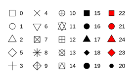

```{r setup, include=FALSE}
knitr::opts_chunk$set(echo = TRUE)
```

import tidyverse library
```{r}
library(tidyverse)
library(maps)
```

data set will be used in the following examples. ``displ`` engine displacement, in litres. `hwy` highway miles per gallon.
```{r}
head(mpg)
```

### A graphing template

``ggplot(data = <DATA>) + ``

  ``<GEOM_FUNCTION>(``

   ``mapping = aes(<MAPPINGS>),``
   
   ``stat = <STAT>, ``
   
   ``position = <POSITION>``
     
  ``) +``
  
  ``<COORDINATE_FUNCTION> +``
  
  ``<FACET_FUNCTION>``
  
  
The scatterplot shows a negative relationship between engine size (displ) and fuel efficiency (hwy). 

```{r}

ggplot(data = mpg) +  # create coordinates for the plot
  geom_point(mapping = aes(x = displ, y = hwy)) # add a layer of points to the plot
```

### Aesthetic mappings
We can adjust color, size, shape, alpha (transparency) of the point.

```{r}
ggplot(data = mpg) + 
  geom_point(mapping = aes(x = displ, y = hwy, color = class))


ggplot(data = mpg) + 
  geom_point(mapping = aes(x = displ, y = hwy, size = class))
#> Warning: Using size for a discrete variable is not advised.

ggplot(data = mpg) + 
  geom_point(mapping = aes(x = displ, y = hwy, alpha = class))

ggplot(data = mpg) + 
  geom_point(mapping = aes(x = displ, y = hwy, shape = class))
  
```


adjust color, shape, transparency, size.


```{r}
ggplot(data = mpg) + 
  geom_point(mapping = aes(x = displ, y = hwy), color = "blue")


ggplot(data = mpg) + 
  geom_point(mapping = aes(x = displ, y = hwy), shape = 0)
```


### Facets
One way to add additional variables is with aesthetics. Another way, particularly useful for categorical variables, is to split your plot into facets, subplots that each display one subset of the data.

The variable that you pass to ``facet_wrap()`` should be discrete.
```{r}
ggplot(data = mpg) + 
  geom_point(mapping = aes(x = displ, y = hwy)) + 
  facet_wrap(~ class, nrow = 2)
```


```{r}
ggplot(data = mpg) + 
  geom_point(mapping = aes(x = displ, y = hwy)) + 
  facet_grid(drv ~ cyl)

```

### Geometric objects
we can use different **geom** function to represent data.
```{r}
# ggplot(data = mpg) + 
#   geom_smooth(mapping = aes(x = displ, y = hwy)) +
#   geom_point(mapping = aes(x = displ, y = hwy))

ggplot(data = mpg, mapping = aes(x = displ, y = hwy)) + 
  geom_point(mapping = aes(color = class)) + 
  geom_smooth()
```

```{r}
ggplot(data = mpg) + 
  geom_smooth(mapping = aes(x = displ, y = hwy, linetype = drv))
```

```{r}
ggplot(data = mpg, mapping = aes(x = displ, y = hwy)) + 
  geom_point(mapping = aes(color = class)) + 
  geom_smooth(data = filter(mpg, class == "subcompact"), se = FALSE)
```

### Statistical transformation

data set will be used for the following examples.
```{r}

head(diamonds)
```

* bar charts, histograms, frequency polygons bin your data
* smoothers fit a model to your data 
* boxplots compute a robust summary of the distribution

```{r}

ggplot(data = diamonds) + 
  geom_bar(mapping = aes(x = cut, fill = cut))

# 
# ggplot(data = diamonds) + 
#   geom_bar(mapping = aes(x = cut))

## same as 
# 
# ggplot(data = diamonds) + 
#   stat_count(mapping = aes(x = cut))

ggplot(data = diamonds) + 
  geom_bar(mapping = aes(x = cut, fill = clarity))
```
The stacking style can be adjusted by ``position``. **identity**, **dodge**, **fill**

```{r}
ggplot(data = diamonds) + 
  geom_bar(mapping = aes(x = cut, fill = clarity), position = "fill")

ggplot(data = diamonds, mapping = aes(x = cut, fill = clarity)) + 
  geom_bar(alpha = 1/5, position = "identity")

ggplot(data = diamonds) + 
  geom_bar(mapping = aes(x = cut, fill = clarity), position = "dodge")
```
```{r}
ggplot(data = diamonds) + 
  stat_summary(
    mapping = aes(x = cut, y = depth),
    fun.min = min,
    fun.max = max,
    fun = median
  )
```

### coordinate systems
```{r}
ggplot(data = mpg, mapping = aes(x = class, y = hwy)) + 
  geom_boxplot()
ggplot(data = mpg, mapping = aes(x = class, y = hwy)) + 
  geom_boxplot() +
  coord_flip()
```

``coord_quickmap()`` important when plotting spatial data

```{r}
nz <- map_data("nz")

ggplot(nz, aes(long, lat, group = group)) +
  geom_polygon(fill = "white", colour = "black")

ggplot(nz, aes(long, lat, group = group)) +
  geom_polygon(fill = "white", colour = "black") +
  coord_quickmap()
```

```{r}
bar <- ggplot(data = diamonds) + 
  geom_bar(
    mapping = aes(x = cut, fill = cut), 
    show.legend = FALSE,
    width = 1
  ) + 
  theme(aspect.ratio = 1) +
  labs(x = NULL, y = NULL)

bar + coord_flip()
bar + coord_polar()
```


R for data science
https://r4ds.had.co.nz/


